# TencentOS Tiny小熊派MicroPython快速入门指南

| Revision | Date       | Description |
| -------- | ---------- | ----------- |
| 1.0      | 2022-10-12 | 文档初版    |

## 一. MicroPython 简介

MicroPython 是 Python 3 语言的精简实现 ，包括 Python 标准库的一个子集，能够在微控制器和受限环境中运行。MicroPython 可在不同平台上运行，为开发者提供快捷的嵌入式开发方式。

## 二. MicroPython 开发环境准备

### 2.1 MDK软件介绍

MDK 即 RealView MDK 或 MDK-ARM（Microcontroller Development kit），是 ARM 公司收购 Keil 公司以后，基于 uVision 界面推出的针对 ARM7、ARM9、Cortex-M0、Cortex-M1、Cortex-M2、Cortex-M3、Cortex-R4 等 ARM 处理器的嵌入式软件开发工具。MDK-ARM 集成了业内最领先的技术，包括 uVision4 集成开发环境与 RealView 编译器 RVCT。支持 ARM7、ARM9 和最新的 Cortex-M3/M1/M0 核处理器，自动配置启动代码，集成 Flash 烧写模块，强大的 Simulation 设备模拟，性能分析等功能，与 ARM 之前的工具包 ADS 等相比，RealView 编译器的最新版本可将性能改善超过 20%。
Keil 公司开发的 ARM 开发工具 MDK，是用来开发基于 ARM 核的系列微控制器的嵌入式应用程序。它适合不同层次的开发者使用，包括专业的应用程序开发工程师和嵌入式软件开发的入门者。MDK 包含了工业标准的 Keil C 编译器、宏汇编器、调试器、实时内核等组件，支持所有基于 ARM 的设备，能帮助工程师按照计划完成项目。

### 2.2 MDK安装

登录 MDK 官网，下载 MDK5 软件，下载地址：
http://www2.keil.com/mdk5  或者 https://www.keil.com/download/product/
下载的版本最好在5.24以上，本开发教程以5.24版本为例，双击 MDK524 应用程序文件，点击 next>>。


勾选“I agree to ...”，即是同意一些安装协议。点击 Next>>。


选择安装路径，可以默认也可以安装在我们自己建立的文件夹下。点击 Next>>。

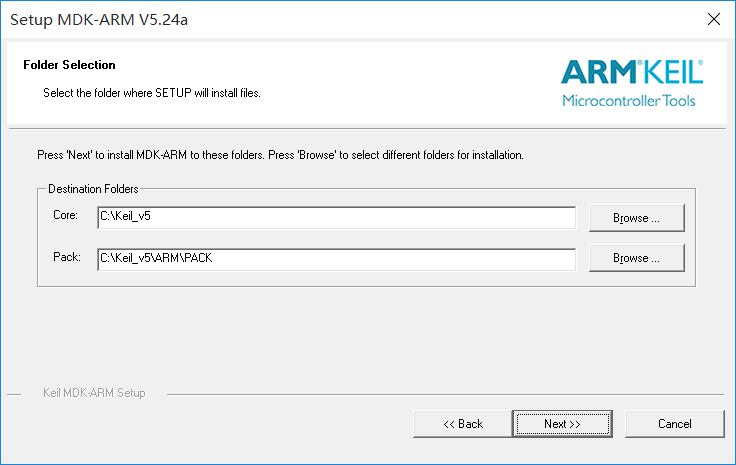

这里填写的是一些用户信息，填写完整后，继续点击 Next>>。


然后等待安装完成即可。


安装完成，点击 Finish。


然后会跳出来这个界面，这个我们后面再讲，先点 OK，把弹框都叉掉。


激活 MDK，导入 License，激活 MDK 后便可使用了。


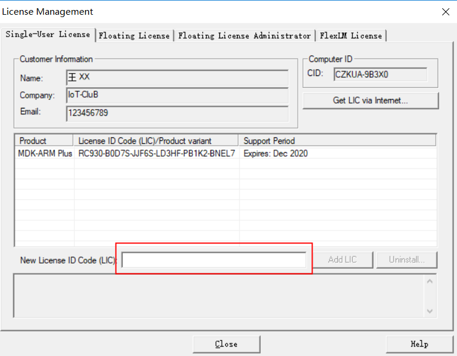

特别提示：一定要输入 License 激活 MDK 软件，建议购买正版 License。

### 2.3 MDK 安装 Pack

安装完 MDK 后，我们需要安装开发套件中单片机型号对应的 Pack。

**安装方式一**  登录官网：http://www.keil.com/dd2/pack/ 
下载 Keil.STM32L4xx_DFP.2.0.0.pack 后安装，如下图

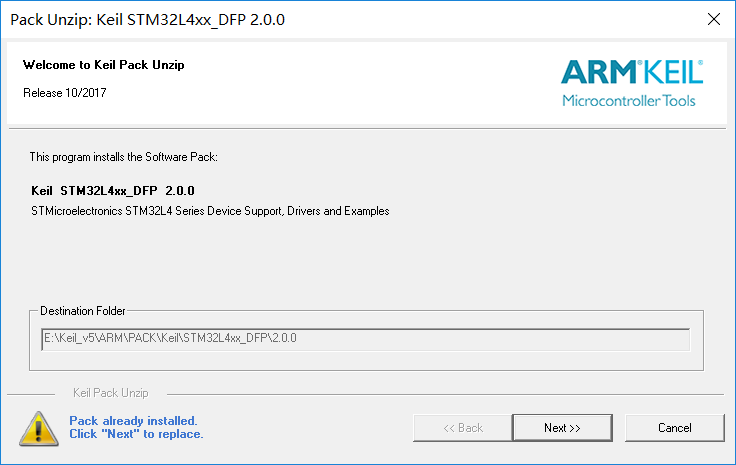

**安装方式二**  MDK 软件上在线安装

打开软件，在导航栏打开 Pack 安装界面，然后选择 ok 选项。

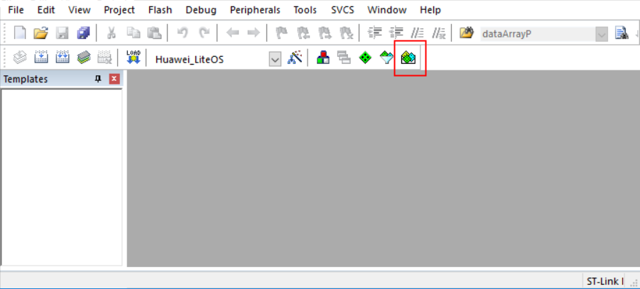

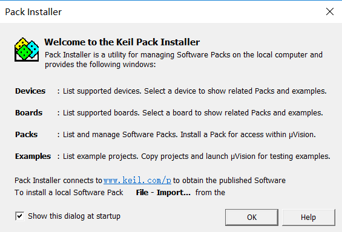

进入在线安装界面，选择 STM32L4XX Pack，点击 Install 进行安装。


至此，我们开发板的单片机程序开发环境已经搭建完毕，重启 MDK 软件就可以使用了。

### 2.4 ST-Link 驱动安装

前面讲了开发板单片机程序的开发环境的搭建，但是为了将程序烧录到开发板中我们还需要使用仿真器。我们这套开发板选用 ST 公司的 ST-Link V2 仿真器进行开发板程序的烧写和仿真，下面介绍 ST-Link 驱动的安装及环境搭建。
在 ST 官网下载 ST-Link 驱动，
https://www.st.com/content/st_com/zh/products/development-tools/software-development-tools/stm32-software-development-tools/stm32-utilities/stsw-link009.html

（驱动有2种： 32位电脑系统安装“dpinst_x86”、64位电脑系统安装“dpinst_amd64”）。 


运行对应的驱动，安装 ST-Link V2 驱动程序。安装路径尽量保持默认路径。


安装完成后, 将小熊派开发板通过 USB 接口连入电脑（开发板上自带 ST-Link）。打开“设备管理器”。若看到如下图所示，表示驱动安装成功。


这里提醒 2 点:
1，	各种 Windows 版本设备名称和所在设备管理器栏目可能不一样，例如 Win10 插上 STLINK 后显示的是 STM32 STLINK。
2，	如果设备名称旁边显示的是黄色的叹号，请直接点击设备名称，然后在弹出的界面点击更新设备驱动
至此， ST-Link 驱动已经安装完成。接下来大家只需要在 MDK工程里面配置一下 ST-Link 即可。

### 2.5 CH340 串口驱动安装

互联网搜索下载 CH340 串口芯片的驱动

安装方法：打开驱动安装程序点击安装即可。


注：若安装失败，请先点击卸载，后点击安装。

### 2.6 安装串行终端软件

#### 2.6.1 安装 mpremote [可选]

MicroPython 官方提供了使用 Python 实现的命令行工具 mpremote。在安装了 Python 的情况下，mpremote 可以通过以下命令安装：

```
pip install mpremote
```

USB-TTL 模块连接到 PC 上后，可以在”设备管理器-端口（COM 和 LPT）“中看到对应的端口名：

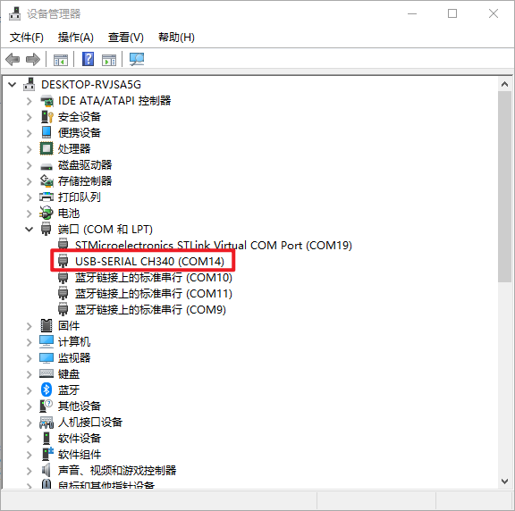

图中显示的端口名为 COM14，在命令行中输入下列命令可以快速连接到 COM14 的串口设备上。

```
mpremote connect COM14
```

连接完成后，就可以在串行终端上进行操作了。

mpremote 还针对 MicroPython 提供了其他便捷的功能，详情可以参考 MicroPython 官方文档：https://docs.micropython.org/en/latest/reference/mpremote.html。

#### 2.6.2 安装 Tabby 或其他串行终端软件 [可选]

Tabby 是一个开源的、高度可配置的现代化终端，集成了 SSH 和串行终端等功能。
在 Tabby 的 Github 仓库中可以下载最新版本的安装包，仓库地址为：https://github.com/Eugeny/tabby/releases/latest

安装完成后，打开 Tabby Terminal，点击“Profiles&connections”按钮：

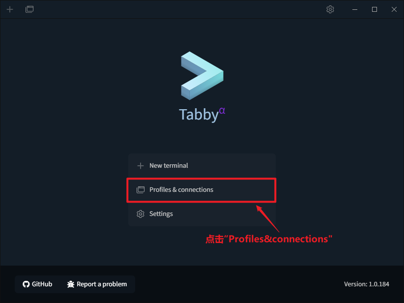

在弹出的菜单中，筛选“Serial:”开头的设备，找到需要的设备进行连接：

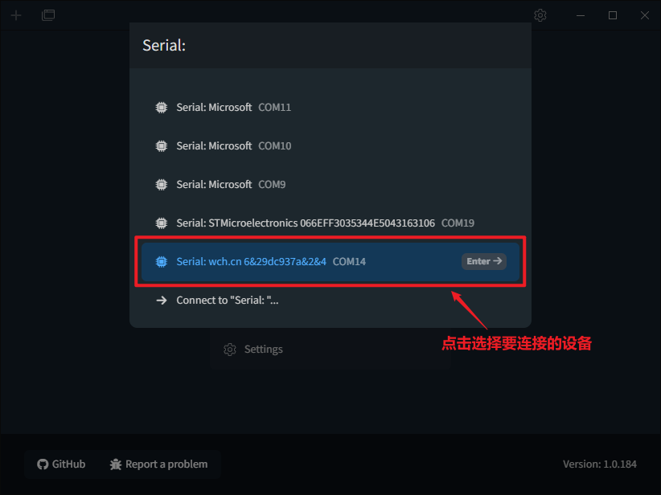

选择所需的波特率，常见波特率有115200和9600：

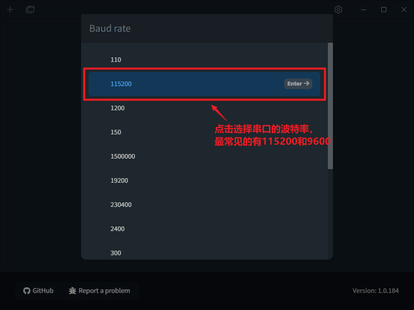

连接完成后就可以在串行终端上进行操作了。

## 三. MicroPython 基础 demo 

### 3.1 基础 demo 工程

#### 3.1.1 打开 TencentOS Tiny 提供的 micropython_basic_demo 工程

TencentOS Tiny 官方开源仓库下载源码，地址为：
https://github.com/Tencent/TencentOS-tiny

进入 <TencentOS-tiny/board/BearPi_STM32L431RC/KEIL/micropython_basic_demo> 目录，打开 BearPi_STM32L31RC.uvprojx 工程

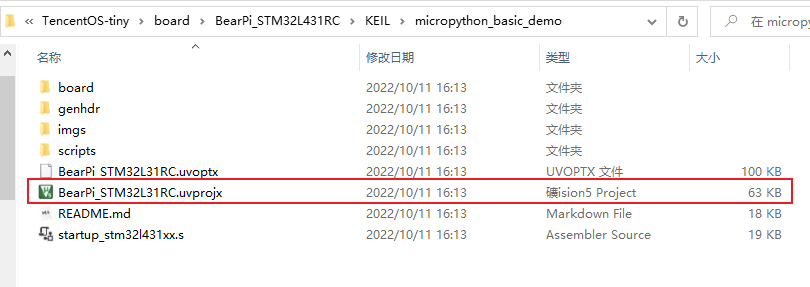

#### 3.1.2 编译 micropython_basic_demo 工程

打开工程后，在左侧的工程文件导航页面打开 examples 目录，可以看到 micropython_demo.c 源码，这里主要创建了一个 MicroPython 的任务，任务中通过调用 mp_main 函数启动 MicroPython 的主要功能。开发者可以按照下图指示，点击编译按钮编译整个工程，如图：


#### 3.1.3 下载运行

使用 USB 线将开发板连接到 PC，配置下载环境，点击下图按钮，进入工程配置界面：

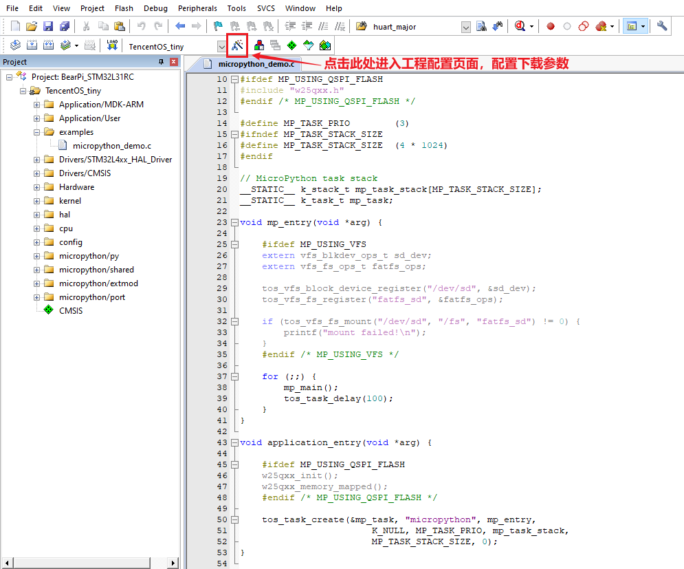

按照下图提示配置下载器类型和 Flash 下载算法：


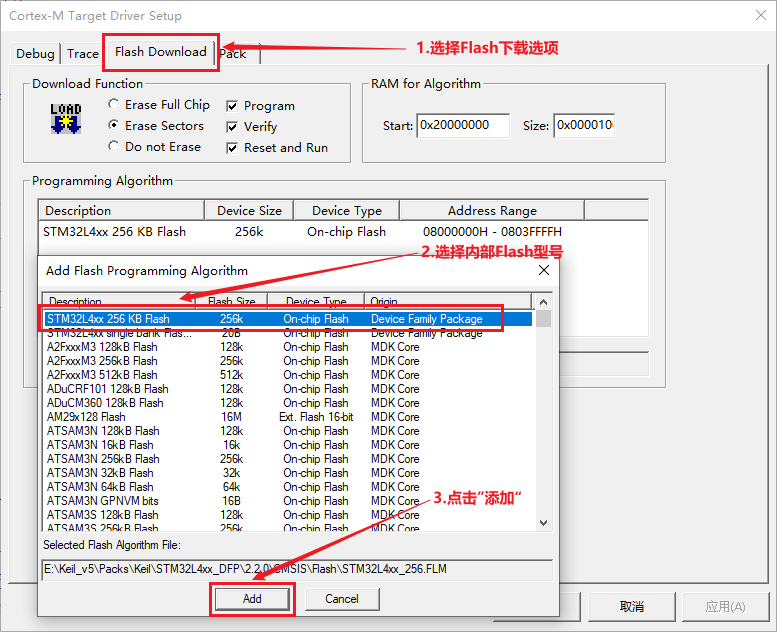

编译完成后，点击如图所示“LOAD”按钮下载程序即可。

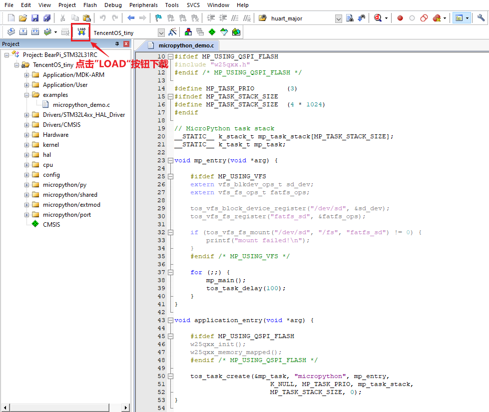

#### 3.1.4 通过终端串口软件连接到 MicroPython REPL

MicroPython REPL 是 MicroPython 的交互式解释器，可以实现 MicroPython 语句的输入执行和输出，关于 REPL 的详细用法可以参考**官方文档**了解。官方文档链接为：https://docs.micropython.org/en/latest/reference/repl.html

首先将开发板与 USB-TTL 模块相连，micropython_basic_demo 工程默认将 UART2 用于 REPL 的输入输出，波特率为115200。

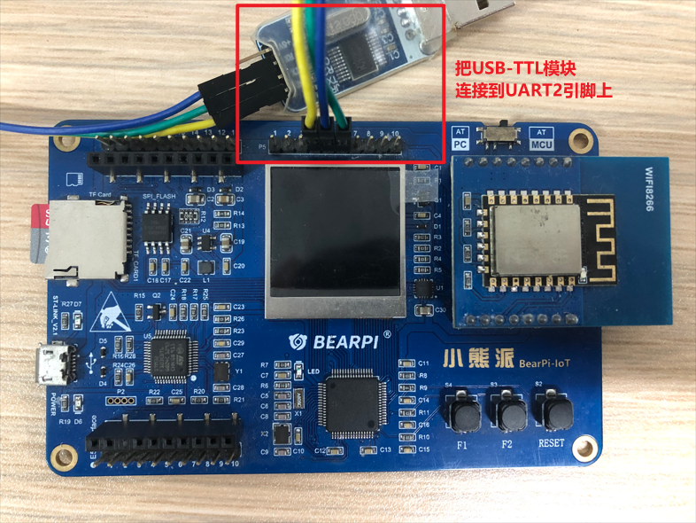

然后将 USB-TTL 模块连接到 PC 上，查看设备管理器找到正确的串行端口。然后用终端串口软件连接到对应的端口，就可以使用 MicroPython 了。关于串口终端软件的安装和使用可以参考第2.6节“[安装串行终端软件](#2.6-安装串行终端软件)”。

在终端串口软件中输入回车，如果能看到 Python 的 REPL 提示符“>>>”，证明已经成功连接到 MicroPython REPL  上了。

下图展示了在 PowerShell 中使用 mpremote 连接 MicroPython REPL 的现象：

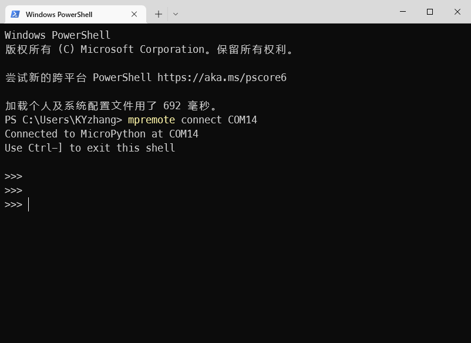

### 3.2 基础 demo 模块介绍

#### 3.2.1 help('modules') 命令

在 REPL 中执行 help('modules') 命令，可以看到当前 MicroPython 固件中包含哪些模块。基础 demo 中包含的模块较少，如下图所示。


如果需要特定的内置模块，可以在第3.4节“[在基础demo工程上进行扩展](#3.4-在基础demo工程上进行扩展)”中了解如何将需要的 MicroPython 内置模块加入到基础 demo 工程中。

#### 3.2.2 模块介绍

| 模块名称    | 模块简介                                                     |
| ----------- | ------------------------------------------------------------ |
| uarray      | 数组，可以针对特定类型创建数组，并对数组进行添加或扩展等操作 |
| builtins    | 内置的函数和异常                                             |
| gc          | 控制垃圾回收器，可以启动或禁用自动垃圾回收，也可以进行手动的垃圾回收 |
| math        | 数学函数（暂时不提供 expm1, log2, log10, cosh, sinh, tanh, acosh, asinh, atanh, erf, erfc, gamma 和 lgamma 等特殊函数） |
| ustruct     | 打包和解包，可以将 Python 中的 Bytes 对象作为C语言的结构体进行处理 |
| usys        | 系统相关函数                                                 |
| utime       | 与时间相关的函数（目前不提供和日历时间相关的功能）           |
| \_thread    | 提供多线程支持                                               |
| umachine    | 与硬件相关的函数                                             |
| micropython | 访问和控制 MicroPython 的内部实现                              |

上述模块中，部分模块名以字母‘u’开头，这表明他们是 MicroPython 可以被替换的内部模块。这些模块在使用时，开头的‘u’可以被省略，比如：`import machine` 等同于 `import umachine`。

以下划线‘\_’开头的模块表示该模块还在实验中，在使用时开头的下划线不能被省略。

以上模块都可以在**官方文档**中找到详细使用方式，官方文档链接：https://docs.micropython.org/en/latest/library/index.html

### 3.3 运行示例脚本

#### 3.3.1 通过REPL粘贴模式快捷运行脚本

连接到 MicroPython 的 REPL 后，可以输入 \<Ctrl-E> 进入粘贴模式。在粘贴模式下，REPL会关闭自动缩进功能，也允许输入空行，方便粘贴写好的脚本。

脚本粘贴完成后，输入 \<Ctrl-D> 可以退出粘贴模式，并开始执行脚本。

例如：将 pin.py 脚本的内容通过粘贴模式输入到 REPL 中如下图所示。


#### 3.3.2 通过 mpremote 快捷运行脚本

mpremote 是 MicroPython 官方提供的命令行工具，除了连接串口 REPL 以外，还可以实现快捷运行脚本的功能。

在 PC 上运行以下命令可以快速运行脚本：

```
mpremote connect <device> run <file>
```

\<device> 是 PC 上连接到 REPL 的串行端口名称，\<file> 是待执行的脚本文件的路径。

例如：使用 mpremote 在 COM14 端口的 REPL 运行  pin.py 脚本的命令如下。

```
mpremote connect COM14 run ./pin.py
```

#### 3.3.3 示例脚本运行现象

进入 <TencentOS-tiny/examples/micropython_demo/scripts> 目录可以看到 TencentOS Tiny 提供的四个示例脚本：


MicroPython 基础 demo 可以运行两个示例脚本，分别是 pin.py 和 thread.py：

* **pin.py 脚本**展示了 umachine 模块和 utime 模块的部分用法。运行脚本后，LED 每过 0.5s 亮灭状态变化一次；按下按键1，打印一行文本 “key1 is pressed”，释放按键1，打印一行文本 “key1 is released”；按下按键2，LED 不再闪烁，脚本退出。
* **thread.py 脚本**展示了 _thread 模块的使用方法。脚本会创建四个线程，序号分别为0~3，每个线程会在打印自己的序号后退出。

### 3.4 在基础 demo 工程上进行扩展

基础 demo 工程只包含了有限的 MicroPython 的功能，可以通过修改工程目录下的 board/mpconfigboard.h 文件对 MicroPython 的功能进行扩展，文件中用于功能扩展的宏定义及其描述如下表。表格中还给出了该功能依赖的文件/TOS组件，可以根据需要在工程中添加。

| 宏定义                         | 描述                              | 依赖的文件/组件                                              |
| ------------------------------ | --------------------------------- | ------------------------------------------------------------ |
| MP_USING_QSPI_FLASH            | 使用外部 QSPI-Flash 扩展内部 ROM 空间 | 开发板目录/BSP/Hardware/W25Qxx-QSPI/w25qxx.c                 |
| MP_USING_VFS                   | 启用 uos 模块，启用 VFS 功能          | tos_vfs 组件，<br>extmod/vfs.c，<br>extmod/vfs_reader.c，<br>extmod/moduos.c |
| MP_USING_MACHINE_SPI           | 在 umachine 模块中启用 SPI 功能         | extmod/machine_spi.c，<br>drivers/bus/softspi.c，            |
| MP_USING_MACHINE_I2C           | 在 umachine 模块中启用 I2C 功能         | extmod/machine_i2c.c                                         |
| MP_USING_NETWORK               | 启用 network 模块                   | socket_wrapper 组件，<br>sal_wrapper 组件，<br>extmod/modnetwork.c，<br>extmod/modusocket.c，<br>shared/netutils/netutils.c |
| MP_USING_USELECT               | 启用 uselect 模块                   | extmod/moduselect.c                                          |
| 以下模块在扩展 demo 中会自动启用 | -----                             | -----                                                        |
| MP_USING_CMATH                 | 启用 cmath 模块                     | -                                                            |
| MP_USING_UASYNCIO              | 启用 uasyncio 模块                  | extmod/moduasyncio.c                                         |
| MP_USING_UCTYPES               | 启用 uctypes 模块                   | extmod/moductypes.c                                          |
| MP_USING_UZLIBS                | 启用 uzlibs 模块                    | extmod/moduzlibs.c                                           |
| MP_USING_UJSON                 | 启用 ujson 模块                     | extmod/modujson.c                                            |
| MP_USING_URE                   | 启用 ure 模块                       | extmod/modure.c                                              |
| MP_USING_HEAPQ                 | 启用 uheapq 模块                    | extmod/moduheapq.c                                           |
| MP_USING_UHASHLIB              | 启用 uhashlib 模块                  | extmod/moduhashlib.c                                         |
| MP_USING_UBINASCII             | 启用ubinascii模块                 | extmod/modubinascii.c                                        |
| MP_USING_URANDOM               | 启用 urandom 模块                   | extmod/modurandom.c                                          |
| MP_USING_FRAMEBUF              | 启用 framebuf 模块                  | extmod/modframebuf.c                                         |

## 四. MicroPython 扩展 demo

### 4.1 扩展 demo 工程

#### 4.1.1 打开工程前的准备

由于 MicroPython 对 ROM 的需求量较大，为了能够在 ROM 容量有限的小熊派开发板上运行更加完整的 MicroPython 功能，需要利用 Flash 下载算法对 ROM 空间进行扩展。

工程目录下包含了小熊派开发板的外部 Flash 下载算法 BearPi_W25Q64JV.FLM 文件：

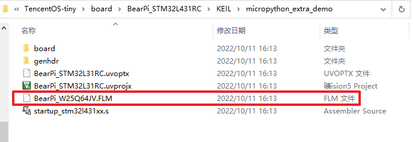

将 BearPi_W25Q64JV 文件拷贝到 **<MDK软件目录>/ARM/Flash** 目录下：


进入 <TencentOS-tiny/board/BearPi_STM32L431RC/KEIL/micropython_extra_demo> 目录，打开  BearPi_STM32L31RC.uvprojx 工程，按照下图指示进入下载选项配置界面：

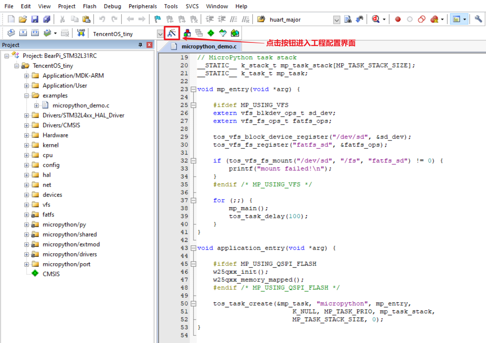


进入“Flash Download”页面，检查“Programming Algorithm”区域和“RAM for Algorithm”区域中的选项是否和下图相同：

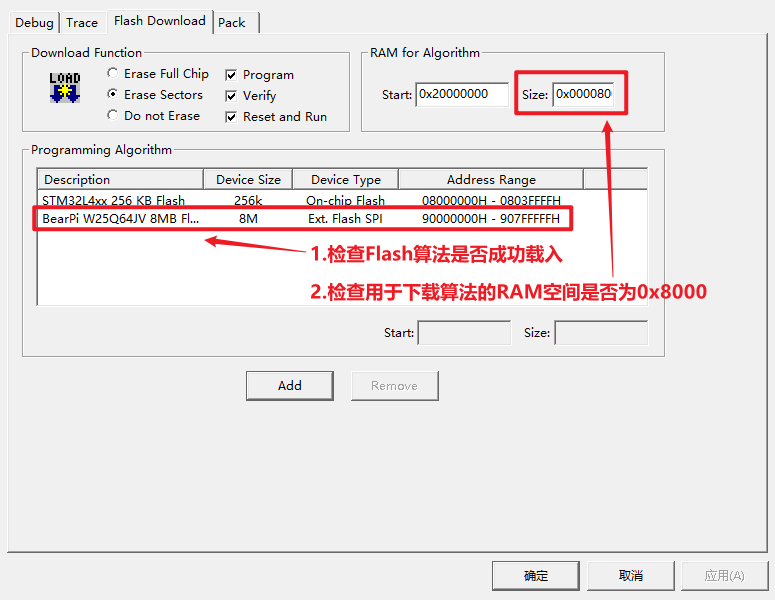

如果不同，需要检查是否已经将 BearPi_W25Q64JV.FLM 文件移动到指定目录，重启 MDK。也可以手动进行修改。

#### 4.1.2 编译，下载和运行

扩展 demo 工程是在基础 demo 工程的基础上扩展部分功能实现的，其编译、下载以及运行步骤基本与基础 demo 工程相同，可以参考第3.1节“[基础 demo 工程](#3.1-基础-demo-工程)”中的相关步骤进行操作。

注意1：扩展 demo 涉及对外部 Flash 的写入，需要的时间较长，请耐心等待。

注意2：扩展 demo 中由于使用了文件系统，因此需要先按照下图，将一张 TF 卡插入到开发板的卡槽中，否则不能正常运行。

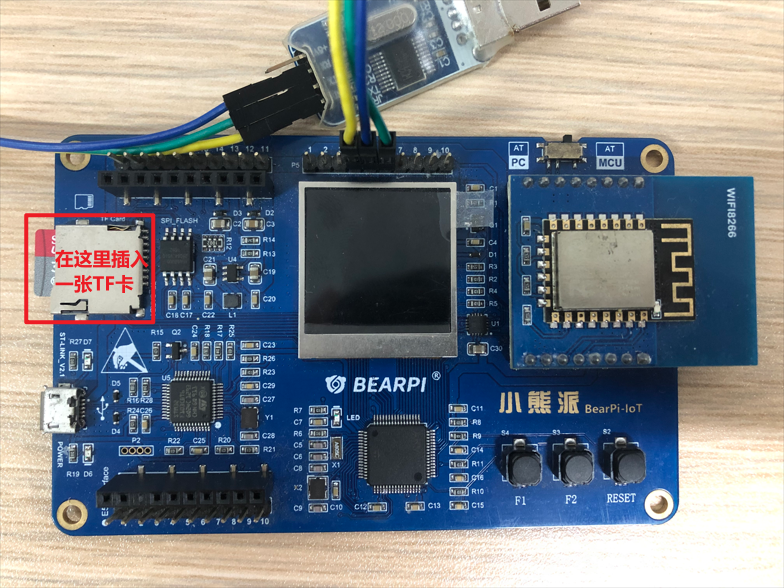

### 4.2 扩展 demo 模块介绍

#### 4.2.1 help('modules') 命令

在 REPL 中执行 help('modules') 命令，可以看到当前 MicroPython 固件中包含哪些模块。扩展 demo 中包含的模块较多，如下图所示。

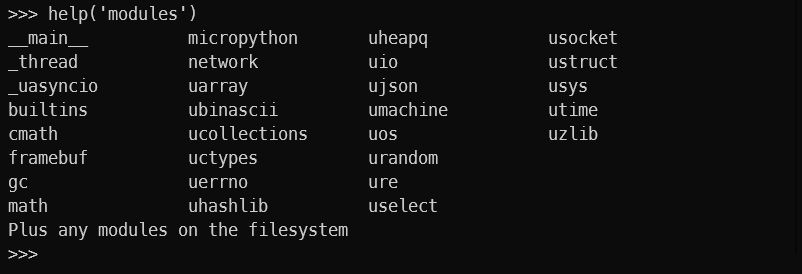

#### 4.2.2 模块介绍

相比于基础 demo，扩展 demo 增加了以下模块，基础 demo 中已经包含的模块可以在第3.2节“[基础 demo 模块介绍](#3.2-基础-demo-模块介绍)”找到介绍：

| 模块名称     | 模块简介                                                     |
| ------------ | ------------------------------------------------------------ |
| ubinascii    | 实现二进制和 ASCII 格式编码的转换，目前可以完成二进制和十六进制字符串的转换以及二进制和 Base64 编码数据的转换 |
| cmath        | 提供复数运算，三角函数运算以及常数e和pi                      |
| ucollections | 容器，包含双端队列、命名元组和有序字典                       |
| uerrno       | 系统错误代码，提供从 OSError 中获取详细错误代码的功能          |
| uhashlib     | 哈希算法，提供 sha256 算法                                     |
| uheapq       | 堆队列算法，提供最小堆队列算法                               |
| uio          | 输入/输出流，提供流对象和辅助函数的支持                      |
| ujson        | JSON 编码和解码功能                                           |
| uos          | 基本“操作系统”服务（目前基本只包含了操作文件系统的功能）     |
| urandom      | 产生随机数                                                   |
| ure          | 简单的正则表达式                                             |
| uselect      | 在一组流中等待事件                                           |
| usocket      | socket 功能（目前不提供服务端的函数，如：bind、listen、accept 等） |
| \_uasyncio   | 异步 I/O 调度功能                                              |
| uzlib        | 提供 zlib 解压功能，可以将使用DEFLATE算法压缩过的二进制数据解压出来 |
| framebuf     | 帧缓冲区操作                                                 |
| network      | 网络配置，提供网络接口的配置（目前只支持把ESP8266配置为网络接口） |
| uctypes      | 按照C语言的方式构造结构化的二进制数据                        |

以上模块都可以在**官方文档**中找到详细使用方式，官方文档链接：https://docs.micropython.org/en/latest/library/index.html


### 4.3 运行示例脚本

#### 4.3.1 通过文件系统自动运行脚本

除了第3.3节“[运行示例脚本](#3.3-运行示例脚本)”中提到的两种快捷运行脚本的方式，扩展 demo 还有第三种运行脚本的方式。由于扩展 demo 中引入了文件系统，因此可以在文件系统中存储启动时自动运行的脚本。

MicroPython 在启动时会依次检查文件系统根目录下是否存在名为“boot.py”和“main.py”的脚本，并依次运行。

例如：通过将 pin.py 脚本移动到 TF 卡根目录中，并改名为 main.py，可以实现启动时自动闪灯的效果。

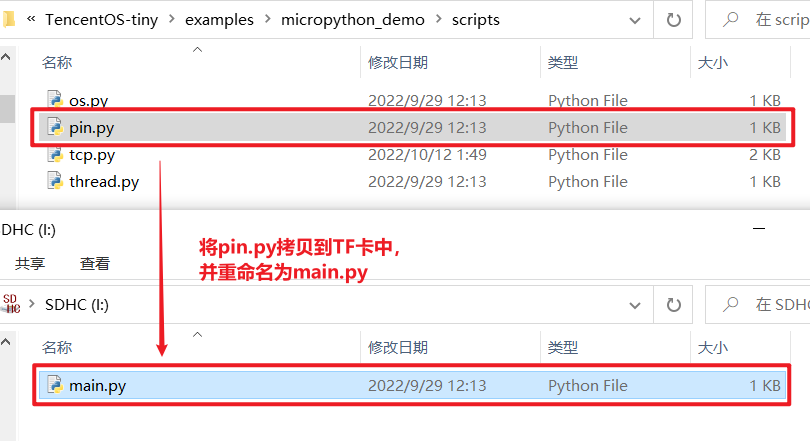

#### 4.3.2 示例脚本运行现象

MicroPython 扩展 demo 可以运行四个示例脚本，除了第3.3节“[运行示例脚本](#3.3-运行示例脚本)”中的 pin.py 和 thread.py 脚本外，还可以运行 os.py 和 tcp.py 脚本：

* **os.py 脚本**测试了 uos 模块中操作文件和目录的主要功能，脚本的运行后会输出以下内容：

  ```
  ---------------test mkdir---------------
  ['System Volume Information']
  ['test_dir', 'System Volume Information']
  ---------------test write---------------
  ['test_file']
  ---------------test read----------------
  ['Hello TencentOS-tiny\n', 'Hello MicroPython\n']
  ----------test with statement-----------
  Hello TencentOS-tiny
  
  Hello MicroPython
  
  --------------test rename---------------
  ['System Volume Information', 'test_dir2']
  ['test_file']
  --------------test unlink---------------
  []
  ['System Volume Information']
  ```

* **tcp.py 脚本**展示了 network 模块和 usocket 模块的基本用法

  注意1：该脚本需要使用 esp8266 模块进行网络通信，因此在运行脚本前，需按照下图所示，安装上 esp8266 模块。

  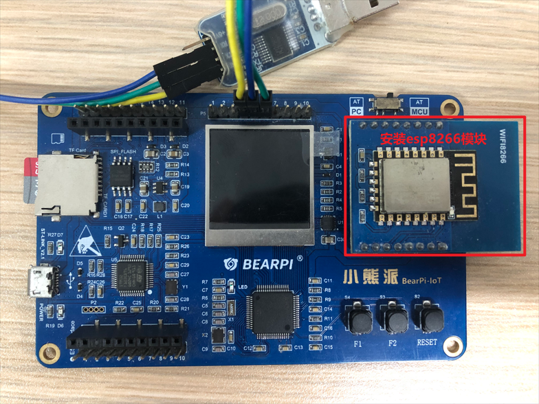

  注意2：脚本中的 WIFI_SSID、WIFI_PASSWORD 以及 SERVER_HOST、SERVER_PORT 需要根据实际 WiFi 和服务器情况进行修改。

  注意3：esp8266 连接 WiFi 时间可能较长，请耐心等待。

  脚本运行的结果与连接到的 TCP 服务器有关，如果连接到 TCP 回声服务器，会输出以下内容：

  ```
  esp8266 init done
  esp8266 connect done
  socket init done
  socket connect done
  send len:18
  recv data:b'This is TCP test!\n'
  send len:18
  recv data:b'This is TCP test!\n'
  send len:18
  recv data:b'This is TCP test!\n'
  send len:18
  recv data:b'This is TCP test!\n'
  send len:18
  recv data:b'This is TCP test!\n'
  ```

  